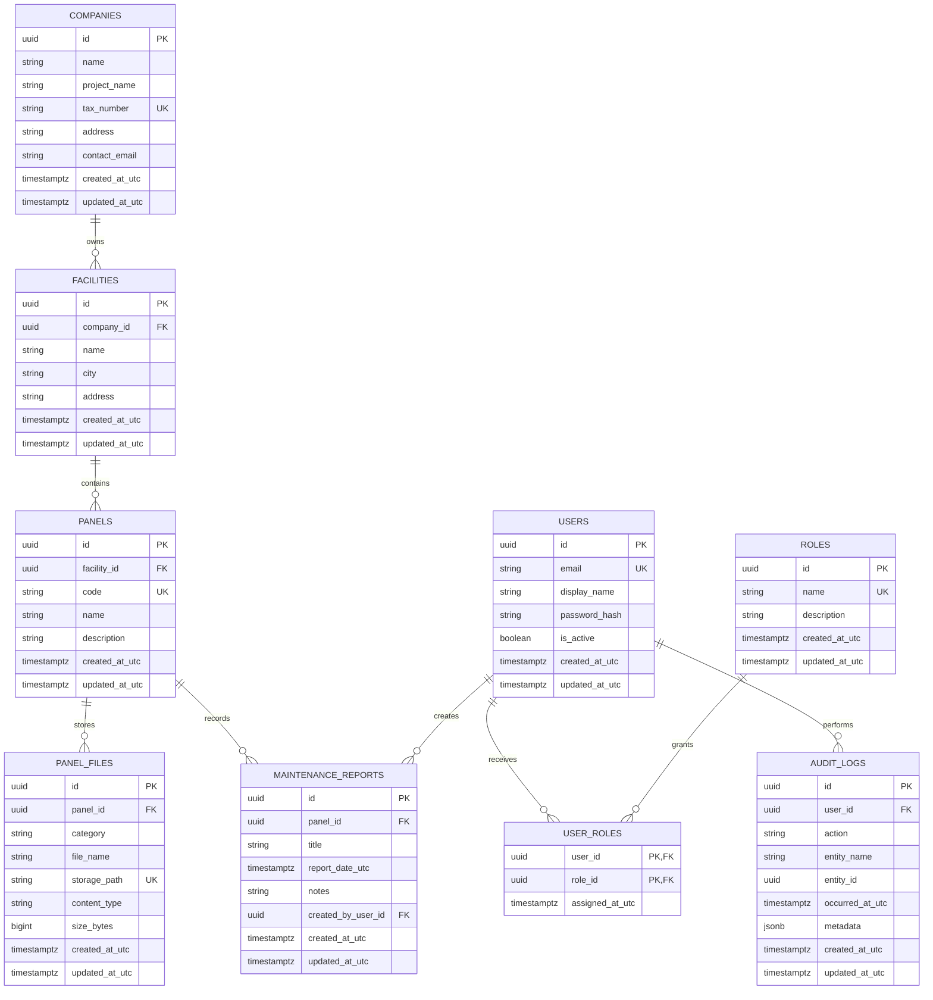

# PanoLogger Database ER Diagram

```mermaid
erDiagram
    COMPANIES ||--o{ FACILITIES : owns
    FACILITIES ||--o{ PANELS : contains
    PANELS ||--o{ PANEL_FILES : stores
    PANELS ||--o{ MAINTENANCE_REPORTS : records
    USERS ||--o{ MAINTENANCE_REPORTS : creates
    USERS ||--o{ USER_ROLES : receives
    ROLES ||--o{ USER_ROLES : grants
    USERS ||--o{ AUDIT_LOGS : performs

    COMPANIES {
        uuid id PK
        string name
        string project_name
        string tax_number UK
        string address
        string contact_email
        timestamptz created_at_utc
        timestamptz updated_at_utc
    }

    FACILITIES {
        uuid id PK
        uuid company_id FK
        string name
        string city
        string address
        timestamptz created_at_utc
        timestamptz updated_at_utc
    }

    PANELS {
        uuid id PK
        uuid facility_id FK
        string code UK
        string name
        string description
        timestamptz created_at_utc
        timestamptz updated_at_utc
    }

    PANEL_FILES {
        uuid id PK
        uuid panel_id FK
        string category
        string file_name
        string storage_path UK
        string content_type
        bigint size_bytes
        timestamptz created_at_utc
        timestamptz updated_at_utc
    }

    MAINTENANCE_REPORTS {
        uuid id PK
        uuid panel_id FK
        string title
        timestamptz report_date_utc
        string notes
        uuid created_by_user_id FK
        timestamptz created_at_utc
        timestamptz updated_at_utc
    }

    USERS {
        uuid id PK
        string email UK
        string display_name
        string password_hash
        boolean is_active
        timestamptz created_at_utc
        timestamptz updated_at_utc
    }

    ROLES {
        uuid id PK
        string name UK
        string description
        timestamptz created_at_utc
        timestamptz updated_at_utc
    }

    USER_ROLES {
        uuid user_id PK, FK
        uuid role_id PK, FK
        timestamptz assigned_at_utc
    }

    AUDIT_LOGS {
        uuid id PK
        uuid user_id FK
        string action
        string entity_name
        uuid entity_id
        timestamptz occurred_at_utc
        jsonb metadata
        timestamptz created_at_utc
        timestamptz updated_at_utc
    }
```
